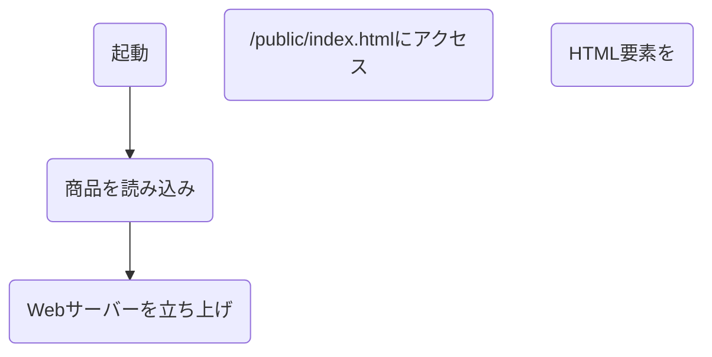
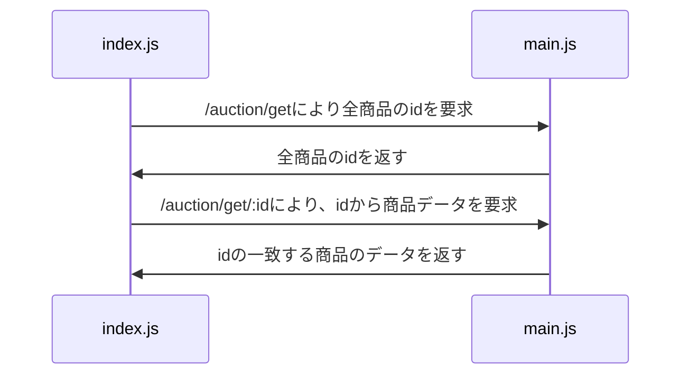

# spa_webpro

# 習っていない要素メモ

[express Router](https://expressjs.com/ja/guide/routing.html)

```mermaid
    flowchart TD;

    StartBackend(起動)
    LoadGoodsBackend(商品を読み込み)
    WebServerHostBackend(Webサーバーを立ち上げ)

    ShowPageFrontend(/public/index.htmlにアクセス)
    LoadDOM(HTML要素を)

    StartBackend --> LoadGoodsBackend
    LoadGoodsBackend --> WebServerHostBackend

```

```mermaid
    sequenceDiagram
    
    index.js ->> main.js: /auction/getにより全商品のidを要求
    main.js ->> index.js: 全商品のidを返す
    index.js ->> main.js: /auction/get/:idにより、idから商品データを要求
    main.js ->> index.js: idの一致する商品のデータを返す
```